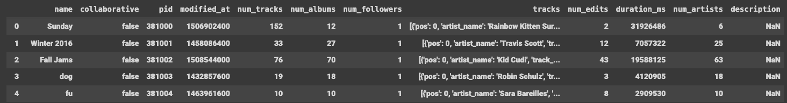
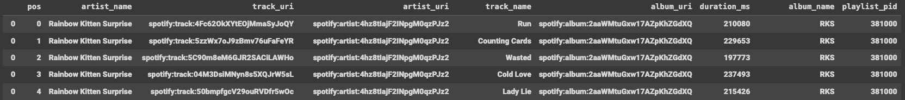
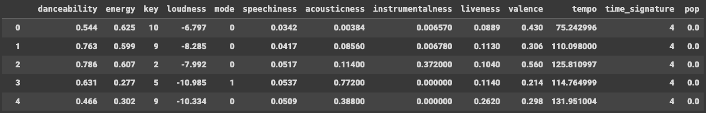

# Automatic Playlist Continuation

This project performs automatic continuation of Spotify playlists by implementing a two-stage recommender system: the candidate generation step finds tracks similar to the playlist, then the ranking step orders them to recommend to most relevant tracks first.

## Dataset
We use the Spotify Million Playlist dataset. Spotify launched an open-ended challenge for music recommendation research at the ACM RecSys 2018 conference. The dataset is now available on AIcrowd: [link to dataset](https://www.aicrowd.com/challenges/spotify-million-playlist-dataset-challenge). 

It consists of one million playlists with the following information (one row represents one playlist):

Each playlist consists of several tracks that are listed in the column "tracks". If we explode the lists of this column into rows, we would get the following dataframe:

We enrich this dataset using the API "Spotify for Developers" to get more features to describe the tracks:

Likewise, we get additional features to characterize the artists:

The last data preparation step is to transform this data into tfrecords. One row of the training dataset for the candidate generation step corresponds to one candidate track (and all the features we have about this track) and to the 5 previous tracks in the playlist (and the features we have about them and the playlist). 

This will be used to train a two-tower model: one tower for the candidate track and one tower for the playlist (we only consider a track history of the last 5 tracks).

## The design

This project is inspired by two great references. The first one is the article [Recommender Systems, Not Just Recommender Models
](https://medium.com/nvidia-merlin/recommender-systems-not-just-recommender-models-485c161c755e) by NVIDIA Merlin which describes a multi-stage recommender system for music tracks, reprented by the following diagram:

The second is a [tutorial](https://cloud.google.com/blog/products/ai-machine-learning/scaling-deep-retrieval-tensorflow-two-towers-architecture) from Google ML Scientists that shows how to scale deep retrieval recommender systems using Google Cloud Platform and takes the example of playlist automatic continuation. This tutorial mentions two ways of building a two-tower model for this task, as shown in the figure below:

This project applied the second approach which uses Neural deep retrieval.

## How to run the project

The code is in the Python directory `playlist_continuation`. 

The candidate generation step can be performed by calling the class `TheTwoTowers` in `playlist_continuation.candidate_generation.two_tower`. 

As for the ranking step, it can be performed using the class `TheRankingModel` in `playlist_continuation.ranking.ranking_model`. 

